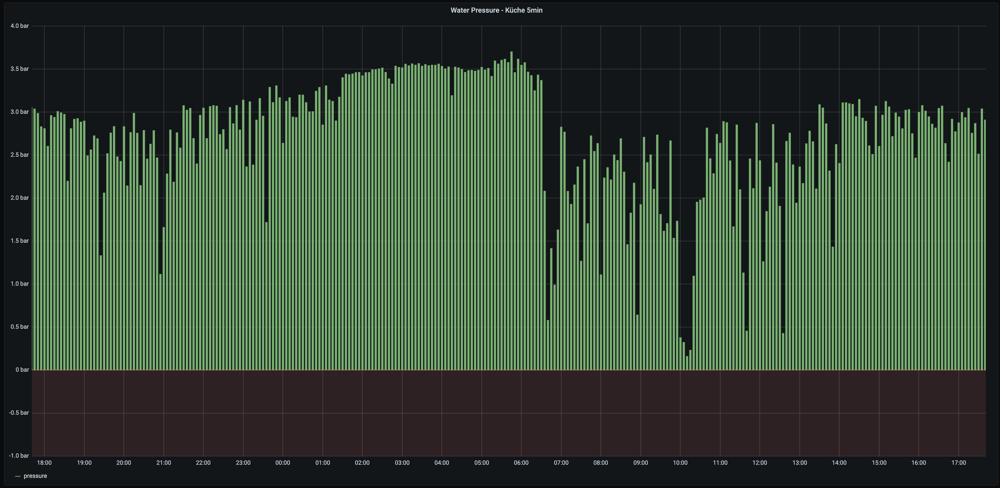

The Water Pressure in our flat seemed to be a bit low from time to time.

To put measurements to feelings I decided to add a pressure sensor to our water installation and log the pressure over time.

Because the Wemos only supports analog input up to 3.3V I needed an arduino that reads the pressure transducer.

The Arduino reads the voltage coming from the transducer, sends it via Serial Console to the ESP which is then publishing the measurement on a MQTT broker. 

After getting all the pieces (some ordered, some bought in the local hardware store) and putting the them together I connected my bike pump to figure out which voltage correlates to which pressure.

| V   | Bar |
|-----|-----|
| 0.5 | 0   |
| 1.3 | 1   |
| 2.0 | 2   |
| 2.7 | 3   |
| 3.5 | 4   |
| 4.1 | 5   |
| 5.0 | 6   |

Trying to remember how math works I came up with the following equation to get the pressure in Bar from the
 measured voltage:

Next step was putting into the System and creating a Grafana Dashboard.

# Parts List

## Electronics
* [Wemos D1 Mini](https://www.amazon.de/dp/B01N9RXGHY)
* [Arduino Nano v3](https://www.amazon.de/dp/B01MS7DUEM)
* [Pressure Transducer 1/4"](https://www.amazon.de/gp/product/B07GLHFCHR)

## Pipe Fittings
* [T-Piece 3/8"](https://www.db-shop24.de/T-Stueck-mit-Aussen-/Innen-/Innengewinde-Messing-vernickelt-3/8-Zoll)
* [Ball Valve](https://www.db-shop24.de/Minikugelhahn-langer-Griff-Innen-Aussengewinde-G-1-4-PN-15)
* [Reducer piece 3/8" → 1/4"](https://www.db-shop24.de/Doppelnippel-G-3-8-G-1-4-14571)
* [Pipe Sealing Cord](https://www.amazon.de/dp/B01F3ABVMM)

## Calibration
* [Schrader → 1/8" Adapter](https://www.amazon.de/gp/product/B078HPB5NP)
* [Reducer piece 1/8" → 1/4"](https://www.amazon.de/gp/product/B016Y6O3FQ/)

